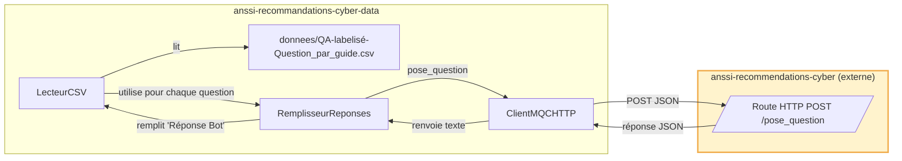
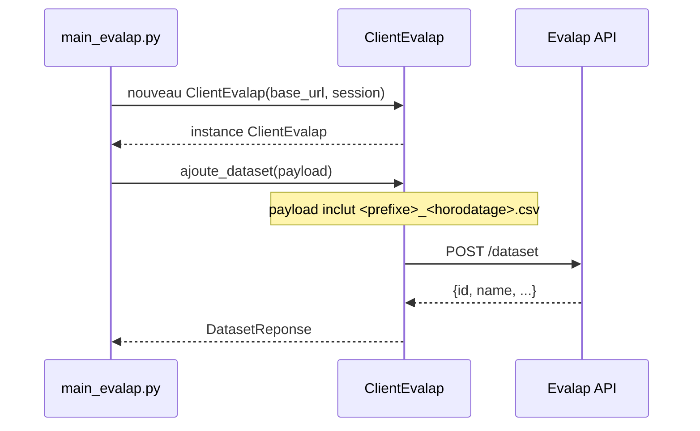

# anssi-recommandations-cyber-data

Une interface permettant d'évaluer le bot de l'ANSSI, basé sur Albert [Albert](https://github.com/betagouv/anssi-recommandations-cyber), et d'y indexer de nouveaux documents RAG.

## 🗺️ Diagramme des interactions entre les composants de l'application

### Interactions pour générer des réponses


### Interactions pour évaluer le dataset


## 📦 Comment installer ?

### Directement sur l'hôte

Il faut installer deux dépendances systèmes, `python` et `uv`.
Ensuite, la première fois il faut créer un environnement virtuel avec `uv venv`.

Dès lors, l'environnement est activable via `source .venv/bin/activate`.
Les dépendances déclarées sont installables via `uv sync`.

## 🧪 Comment valider ?

Dans un environnement virtuel :
* lancer `mypy` pour vérifier la validité des annotations de types,
* et lancer `pytest` pour valider le comportement à l'exécution.

## ⚙️ Comment Définir mes variables d'environnement ?

Il faut créer à la racine du projet un fichier `.env`.
A minima, ce fichier devra définir les variables déclarées dans le fichier `.env.template`.

### Authentification Evalap

Pour utiliser l'API Evalap, ajoutez votre token d'authentification au fichier `.env` :
```
EVALAP_TOKEN=votre_token_ici
```
⚠️ Utilisez directement la valeur du token, sans guillemets ni formatage JSON.

## 🧪 Générer les réponses du bot pour le jeu de validation

### 🎒 Prérequis

1. Lancer l’application [anssi-recommandations-cyber](https://github.com/betagouv/anssi-recommandations-cyber).
Pour cela, nous vous recommandons de démarrer l'application dans le **conteneur** construit avec les instructions de ce dépôt :  
   ```bash
   docker container run --rm -it \
    --network=host \
    --volume $(pwd):/app \
    localhost/mqc/api \
    bash -c "env \$(cat .env) python src/main.py"
    ```
   ⚠️ Pensez à compléter le fichier `.env` à partir du modèle `.env.template`.

2. Vérifier que l’application **MQC** démarre bien en local (endpoint `/pose_question` accessible).

### ▶️ Génération des réponses

Exécuter la commande suivante :

```bash
uv run --env-file .env python -m /main_remplir_csv.py   --csv donnees/jointure-nom-guide.csv   --prefixe evaluation   --sortie donnees/sortie
```

- `--csv` : chemin vers le fichier CSV contenant les questions à évaluer.  
- `--prefixe` : préfixe utilisé dans le nom du fichier de sortie.  
- `--sortie` : dossier où sera écrit le CSV enrichi.  

Un fichier nommé `evaluation_YYYY-MM-DD_H_M_S.csv` sera alors généré dans `donnees/sortie/` avec une colonne **Réponse Bot** remplie automatiquement.

## 📊 Évaluer avec Evalap

### 🎒 Prérequis

1. Avoir défini dans votre fichier `.env` la variable `ALBERT_CLE_API`.  
⚠️ Sans cette variable, Evalap ne pourra pas interroger l’API Albert.
2. Disposer de [docker](https://docs.docker.com/get-docker/) et [docker compose](https://docs.docker.com/compose/install/) installés sur votre machine.  

### ▶️ Lancer Evalap

Depuis la racine du projet, exécuter :

```bash
docker compose -f evalap-compose.yml up -d
```

### ✅ Vérifications

S’assurer que les conteneurs démarrent correctement et que l’interface Evalap est accessible :
- l'IHM de l'API est accessible à l'adresse : http://localhost:8000/docs
- l'IHM de l'application web est accessible à l'adresse : http://localhost:8501

Si les urls ne semblent pas accessibles, vérifier qu’aucun conflit de port n’apparaît dans les logs.

### 📊 Évaluation

Une fois l'application lancée, pour évaluer un jeu de données :

1) Ajouter un dataset. Exécutez :
```bash
uv run --env-file .env python src/main_evalap.py --csv donnees/sortie/evaluation_2025-09-30_17-20-16.csv --nom nom_dataset
```
Le chemin passé à `--csv` est celui généré à l’étape [« ▶️ Génération des réponses »](#%EF%B8%8F-g%C3%A9n%C3%A9ration-des-r%C3%A9ponses).

## 🔧 Ajouter une nouvelle métrique personnalisée Evalap

### 📝 Créer une nouvelle métrique

1. Créer le fichier de métrique dans `src/metriques_personnalisees_evalap/ma_metrique.py`, en se basant sur la [documentation Evalap](https://evalap.etalab.gouv.fr/doc/fr/docs/developer-guide/adding-a-new-metric) :

### 🚀 Déployer la métrique

```bash
docker compose -f evalap-compose.yml build evalap
docker compose -f evalap-compose.yml up -d
```

### ✅ Vérifier que la métrique est disponible

```bash
curl -X GET "http://localhost:8000/v1/metrics" -H "accept: application/json" | jq '.[] | select(.name == "ma_metrique")'
```

Remplacez `ma_metrique` par le nom de votre métrique (ex: `exact_match`).