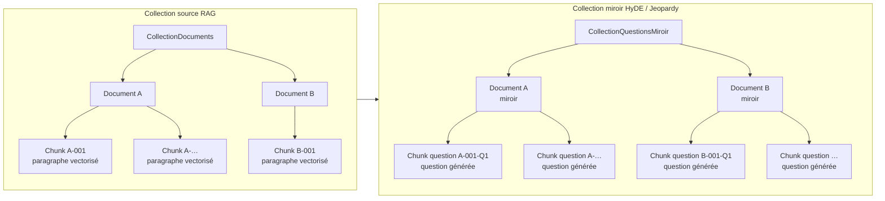
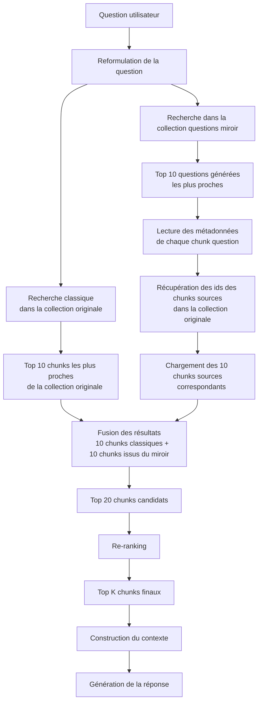
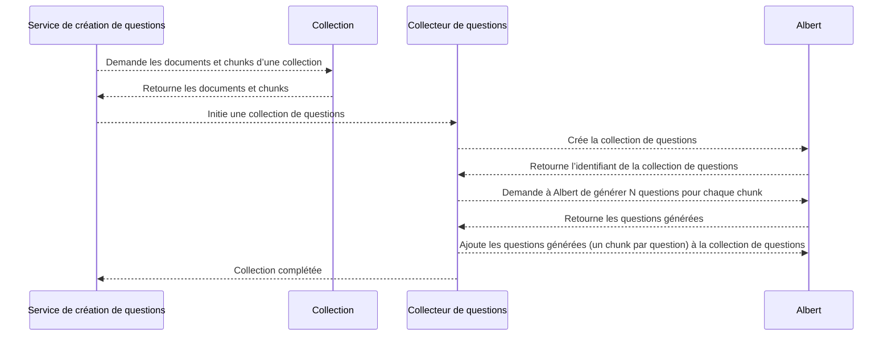

# HyDE

## But 
Générer une collection de questions à partir des chunks générés à partir des documents d'origine. 
Cela nous permettra de confronter des questions utilisateurs·ices à un ensemble de questions données dans un contexte donné.

La génération de questions est réalisée en deux étapes principales :
1. **Extraction de chunks** : Les documents d'origine sont divisés en segments plus petits, appelés chunks.
2. **Génération de questions** : Les chunks sont ensuite utilisés pour générer des questions pertinentes.

### Description des collections
- **Collection source RAG :** La collection des documents d'origine.
- **Collection miroir HyDE / Jeopardy :** La collection miroir des questions générées.



### Cas d’utilisation


## Architecture
Pour une collection donnée, on crée une collection de questions miroir.



### Pistes de réflexion
- On ne génère pas de question pour des chunks trop petits (e.g : `[TITRE] MESURES CYBER PRÉVENTIVES PRIORITAIRES`)

### Typage d’un chunk de question générée
```json
{'object': 'chunk',
  'id': 312,
  'collection_id': 161145,
  'document_id': 4076447,
  'content': 'Ma question ?',
  'metadata': {
               'source_id_document': '4065642',
               'source_id_chunk': 73,
               'source_numero_page': 17
              },
  'created': 1774968050
}
```