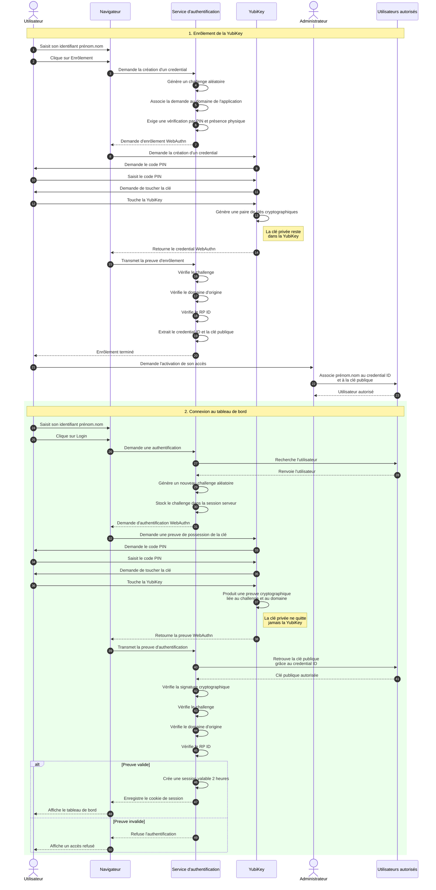

# Enrôlement de la yubikey

**Pré-requis :**
- Une yubikey
- Un navigateur compatible avec WebAuthn
- la dépendance `webauthn`

## Enregistrement
### Enrôlement depuis le navigateur
- Se rendre sur le site `https://app-45a09cd5-dc7e-420b-96c1-f59129b448c4.cleverapps.io/`
- Avoir sa yubikey branchée
- Saisir "prénom.nom" puis cliquez sur "Enrôlement"
- Cliquez dans la popup qui s'ouvre sur la clé
- Saisissez votre code pin

### Demander à l'admin
Une fois l'étape ci-dessus faite, contactez votre administrateur pour qu'il puisse récupérer votre clé publique et l'ajouter dans la variable d'environnement afin que vous puissiez vous authentifier.

## Connection
Une fois enrôlé, vous pouvez vous connecter via la page `https://app-45a09cd5-dc7e-420b-96c1-f59129b448c4.cleverapps.io/` en remplissant "prénom.nom" puis login avec votre clé branchée.

### Fonctionnement

## Processus complet

# Authentification avec Yubikey

## Enrôlement et connexion

